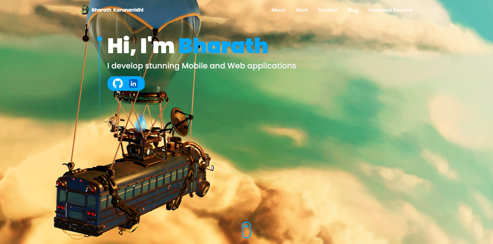

  <h3 align="center">React 3D Portfolio</h3>

## 📋 <a name="table">Table of Contents</a>

1. 🤖 [Introduction](#introduction)
2. ⚙️ [Tech Stack](#tech-stack)
3. 🔋 [Features](#features)

## <a name="introduction">🤖 Introduction</a>

Discover my 3D portfolio crafted in React, Three.js, Tailwind CSS, and Framer Motion. Experience a unique three-dimensional perspective, responsive design with Tailwind CSS, and captivating animations powered by Framer Motion. Stay connected effortlessly with integrated email functionality.

## <a name="tech-stack">⚙️ Tech Stack</a>

- React.js
- Three.js
- TailwindCSS
- Framer Motion
- Emailjs
- React Three Fiber
- React Three Drei
- Vite

## <a name="features">🔋 Features</a>

👉 **3D Portfolio Presentation:** Experience an immersive three-dimensional portfolio created with React, Three.js, Tailwind CSS, and Framer Motion, providing a unique visual perspective.

👉 **Responsive Design:** A fully responsive design crafted with Tailwind CSS, ensuring optimal viewing across various devices and screen sizes.

👉 **Captivating Animations:** Delight in captivating animations powered by Framer Motion, enhancing the user experience with fluid and dynamic transitions.

👉 **Integrated Email Functionality:** Stay connected effortlessly with integrated email functionality, allowing users to contact me directly through email.

👉 **3D Models Usage:** Engage with 3D models used in the intro, tech stack, and contact us sections, adding visual interest and depth to the portfolio.

👉 **Resume Download Option:** Access a downloadable resume directly from the portfolio, providing visitors with a convenient way to learn more about my qualifications and experience.

👉 **Project Showcase:** Showcasing my other mobile and web app development projects, giving visitors a comprehensive view of my expertise.

including code architecture and reusability.

`Overall, this portfolio serves as a testament to who I am, what I am passionate about, and the depth of my capabilities.`
